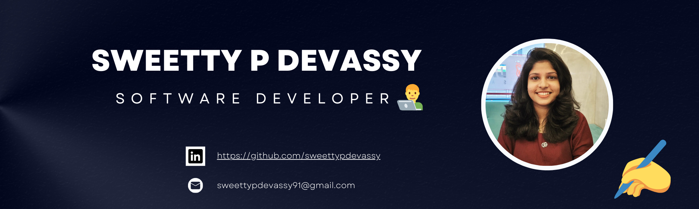

I’m a **Backend Developer at IBM** with 1.5 years of experience, an **Open Source Contributor**, a **Passionate Blog Writer**, and a **Tech Speaker** who loves sharing knowledge through sessions and workshops.  

## 💼 Experience

### **Software Developer | IBM India Private Limited, Kochi**
📅 **01/08/2023 - Present**  
🔹 Working on **JCA and JDBC components** for traditional WebSphere and Open Liberty  
🔹 Contributing to **Bean Validation** in Open Liberty  
🔹 Handling **L3 support cases** and development activities  

### **Software Developer Intern | IBM India Private Limited, Kochi**
📅 **30/01/2023 - 31/07/2023**  
🔹 Handled L3 support cases and contributed to development in JCA, JDBC, and Bean Validation.

## ✍️ Blog Articles  

- **[Virtual Threads: A Game-Changer for Concurrency](https://dzone.com/articles/deep-dive-into-java-virtual-threads-a-game-changer)** 🧵  
  *Published on DZone, this blog explores Java Virtual Threads, comparing them to traditional platform threads with example code.*  

- **[Unleashing Creativity: The Rise of Low-Code and No-Code Platforms](https://medium.com/@sweettypdevassy2001/unleashing-creativity-the-rise-of-low-code-and-no-code-platforms-8c09bd10261b)** 🎨 
  *This blog likens low-code and no-code platforms to an artist's canvas, empowering users to build software without extensive coding.*  

- **[Jakarta WebSocket Essentials: A Guide to Full-Duplex Communication in Java](https://dzone.com/articles/jakarta-websocket-essentials)** 🌐 
  *Published on DZone, this blog demonstrates how to build a real-time chat app using Jakarta WebSocket and Open Liberty.*  

## 🎤 Talks & Presentations  

- **Java 8 to 17 Migration**  
  *Discussed major changes from Java 8 to 17, including JPMS, var, garbage collectors, pattern matching, and best migration practices.*   

- **[Enterprise App Containerization](https://drive.google.com/file/d/1W0UCDC9BBQ7YDIIuHImIP9wP6dcdKa_Z/view)**  
  *Presented how Open Liberty and OpenShift simplify enterprise app deployment, focusing on scalability and cloud-native best practices.*  

- **[The Rise of Low-Code/No-Code Platforms](https://drive.google.com/file/d/1WPZutUhxL7Ex-ucdeeiF8MmH-Uvf_i6o/view)**  
  *Explored how low-code and no-code platforms empower users to develop software with minimal coding, accelerating digital transformation.*  

## 🛠️ Projects  
🔗 Explore my projects on [Github](https://github.com/sweettypdevassy) 

## 🌍 Language Stats  

## 💌 Let's Connect  
  
     

⭐ **Feel free to explore my repositories and connect!** 🚀
